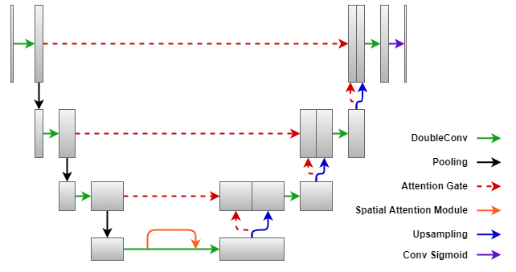

# PyVessel
## Retinal Blood Vessel Segmentation Algorithm

# Pretrained model

|Database       | Accuracy | Precision | Recall | Specificity | F1-score | IoU    |
|---            |---       |---        |---     | ---         | ---      | ---    |
|CHASE\_DB1     | 0.9651   | 0.6835    | 0.8874 | 0.9709      | 0.7704   | 0.6271 |
|AFIO           | 0.9602   | 0.7176    | 0.7627 | 0.9763      | 0.7365   | 0.5852 |
|ORVS           | 0.9696   | 0.6471    | 0.8543 | 0.9755      | 0.7356   | 0.5834 |
|LES-AV         | 0.9776   | 0.8729    | 0.8219 | 0.9903      | 0.8466   | 0.734  |
|STARE          | 0.9529   | 0.6734    | 0.7758 | 0.9704      | 0.7043   | 0.5534 |
|DRIVE          | 0.9633   | 0.7761    | 0.7698 | 0.9805      | 0.7712   | 0.6277 |
|DualModal2019  | 0.9614   | 0.659     | 0.9383 | 0.9632      | 0.7732   | 0.6312 |
|IOSTAR         | 0.9674   | 0.7607    | 0.8192 | 0.979       | 0.787    | 0.649  |
|TREND          | 0.9689   | 0.6316    | 0.6907 | 0.9815      | 0.6581   | 0.491  |
|DR~HAGIS       | 0.9793   | 0.7068    | 0.8246 | 0.9858      | 0.7598   | 0.6148 |
|HRF            | 0.9694   | 0.7811    | 0.8935 | 0.9766      | 0.8321   | 0.7137 |
|ARIA           | 0.9425   | 0.6088    | 0.8079 | 0.9538      | 0.6927   | 0.5312 |
|VAMPIRE        | 0.9705   | 0.5318    | 0.8569 | 0.9744      | 0.6563   | 0.4884 |
|RECOVERY       | 0.9447   | 0.6657    | 0.8448 | 0.9553      | 0.7447   | 0.5932 |
|Własny zbiór   | 0.9838   | 0.8229    | 0.8832 | 0.9894      | 0.8519   | 0.7421 |
|PRIME-FP20     | 0.9946   | 0.7802    | 0.7487 | 0.9975      | 0.7608   | 0.6145 |
|**Average**         | **0.9629** | **0.6826** | **0.8081** | **0.9729** | **0.7352** | **0.5849** |